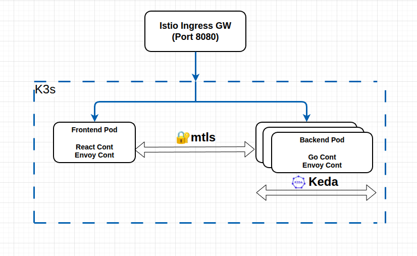

  

# Project Overview

This project is a Kubernetes-based homelab environment designed for hands-on practice and in-depth exploration of cloud-native and DevOps tools. The goal is to build a solid understanding of how modern infrastructure components integrate within a real-world microservices architecture.

## Base Application

The platform is built around a simple connection-testing application that demonstrates communication between services:

Frontend: A web interface built with React that displays the connection status
Backend: A Go-based service responsible for handling requests and validating connectivity

When the backend successfully communicates with the frontend, the application reflects an “online” status.

## Technologies & Tools

The following technologies are currently used in this project:

- Go
- Docker
- Kubernetes
- Istio
- Keda

## 🔐 Istio

All service-to-service communication inside the cluster is secured using Istio STRICT mTLS:

- Traffic is encrypted using mutual TLS  
- Each service is authenticated via strong identity  
- Plain-text or unauthorized traffic is rejected  

This ensures a Zero Trust networking model inside Kubernetes.

## 🚀 KEDA

KEDA (Kubernetes Event-Driven Autoscaling) is an open-source component that enables automatic scaling of applications based on external events, rather than just CPU or memory usage.

### Why KEDA?

- **Event-Driven Scaling**: Scale based on real triggers like HTTP traffic, queue length, or custom metrics
- **Faster Response**: React to demand changes more quickly than traditional autoscaling
- **Resource Efficiency**: Better utilization by scaling based on business events

KEDA automatically scales the backend service during load testing, demonstrating production-ready autoscaling behavior.